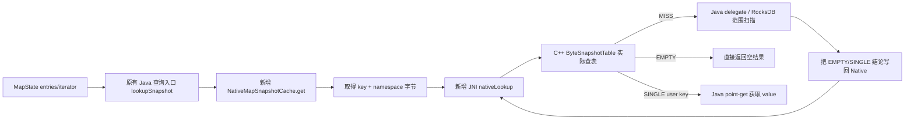
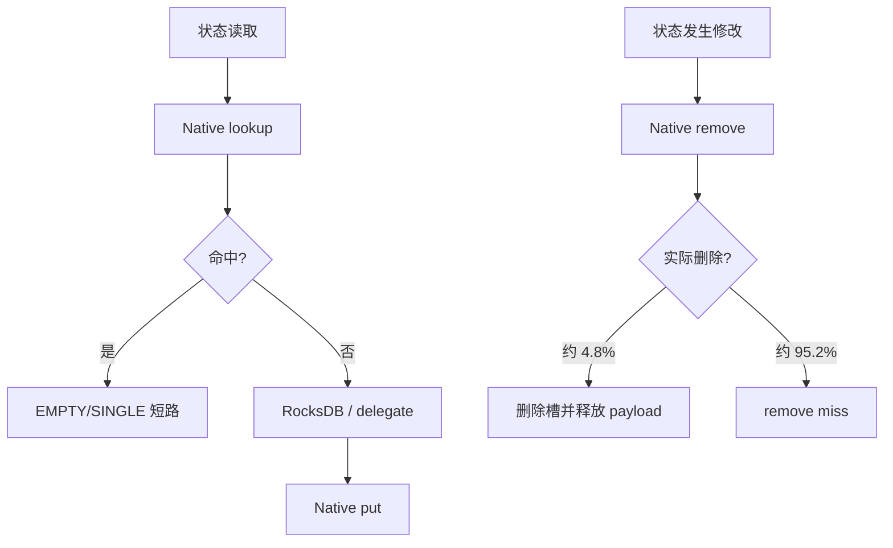
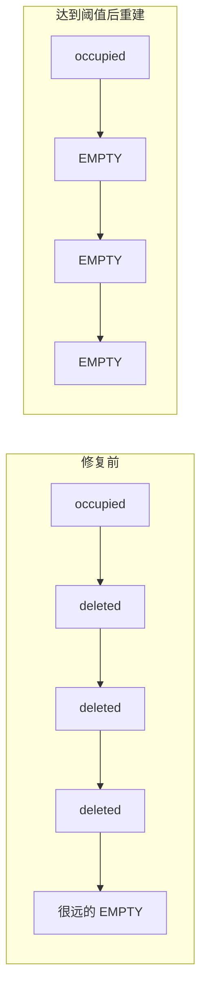
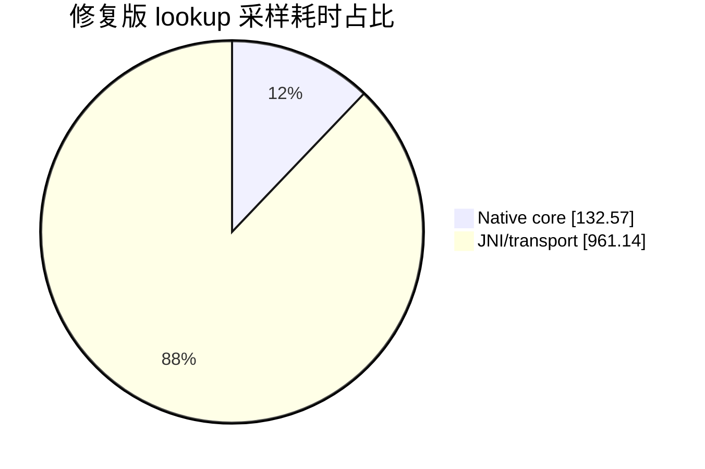
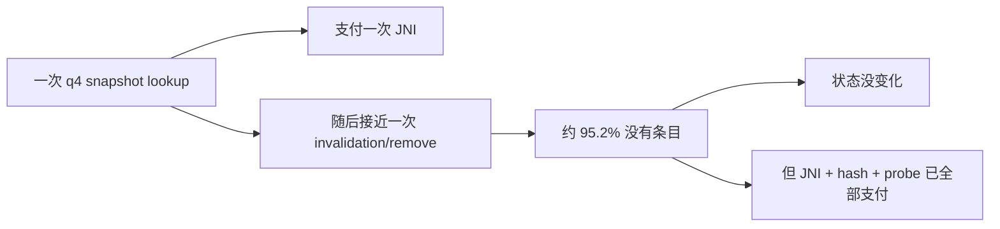

# CacheKit Native Snapshot 缓存技术说明

## 1. 结论

当前已经实现并验证了一套可部署的 Native snapshot 缓存：将 CacheKit 的
`(key, namespace) -> EMPTY/SINGLE` 判定表从 Java `LinkedHashMap` 下沉到 C++，通过 JNI
接入 Flink 状态访问路径。

在本机鲲鹏 HIP09 上，最终 `AUTO` 配置实际选择 `SCALAR`，q4 达到 **803,210 events/s**；
与此前同机 Java snapshot 双次均值 816,525 events/s 相比约低 **1.63%**。这两个数值来自
相邻但不同 campaign，因此 `-1.63%` 是当前工程效果的观测值，不是严格同轮 A/B 置信区间。
严格同轮实验已经证明：tombstone 修复使 Native q4 提升 18.08%，q9 提升 6.50%，q20
按核持平。

在此基础上，本轮又实现了精确 remove membership hint：q4 中安全跳过 96.34% 的 Native
remove JNI，严格 `OFF -> ON -> ON -> OFF` 吞吐均值提升 **3.85%**；q9 提升 0.92%，q20
变化 -0.49%，未发现结构性回退。

最新的鲲鹏指令亲和把 16 B Native table hash 从 FNV64 改为硬件 `CRC32CX`：表级 lookup
从 33.17 降到 17.20 ns/op（-48.1%）。严格 q4 `FNV -> CRC -> CRC -> FNV` 的吞吐均值为
812,270 / 814,220 events/s（+0.24%），两个配对方向相反，因此端到端结论是**无稳定提升、
无总体回退**，不能把微基准收益直接外推为 Nexmark 收益。

一句话概括当前状态：

> Native 表内计算已经足够快，早期的大回退已经修复；当前与 Java 的主要差距是每次
> lookup/put/remove 都要跨越 JNI，而不是 16 B key 的序列化或复制。

## 2. 下沉了什么

### 2.1 当前验证路径

当前推荐并完成 Nexmark 验证的配置是：

```yaml
state.backend.cachekit.map.snapshot.cache.native.enabled: true
state.backend.cachekit.map.snapshot.cache.native.classifier.enabled: false
state.backend.cachekit.map.snapshot.cache.native.kernel: AUTO
```

这条路径下沉的是 snapshot **缓存索引与判定结果**，不是整个 RocksDB，也不是完整 MapState
内容：

- Native key：Flink 当前 key 与 namespace 的组合字节。
- Native value 类型：`EMPTY` 或 `SINGLE`。
- `EMPTY`：该 key/namespace 下没有 map entry。
- `SINGLE`：只有一个 user key；C++ 保存该 Java user key 的 `GlobalRef`。
- `MISS`：Native snapshot 表没有结论，Java 回退到原有 delegate/RocksDB 路径。
- 多 entry 的完整内容不驻留在这张 Native 表中。



因此 Native snapshot 的收益来源仍然是 CacheKit 原有语义：用一次便宜的缓存判定，避免一次
更贵的 RocksDB 范围扫描。下沉只改变判定表的实现位置，不改变上层 EMPTY/SINGLE/MISS
语义。

### 2.2 已实现但当前关闭的路径

代码还实现了 Native classifier 和 prefix batch：snapshot miss 后可以在 C++ 中通过 RocksDB
native handle 做前缀分类或批量读取，再把 key/value 传回 Java。

当前性能结论使用 `classifier.enabled=false`，原因是我们先隔离并验证“Native 缓存表”本身；
打开 classifier 会同时引入范围查询、批量结果创建和 value 反序列化，无法再把收益或回退归因
到 snapshot 表。它不是当前 `-1.63%` 方案的必要组成部分。

## 3. 一次访问如何执行

### 3.1 Lookup

这里有三个名字相似但职责不同的层次：

| 层次 | 是否本次新增 | 是否真正查表 | 作用 |
| --- | --- | --- | --- |
| `CachedInternalMapState.lookupSnapshot()` | 否，Java snapshot 版本已有 | 否 | 统一入口、计数、选择 Java 或 Native 实现、转换结果 |
| `NativeMapSnapshotCache.get()` | 是 | 否 | 准备 key bytes、调用 JNI、把 sentinel 转成 Java `Lookup` |
| JNI `nativeLookup()` → C++ `ByteSnapshotTable::Lookup()` | 是 | 是 | 执行 hash、probe、key 比较和 LRU touch |

完整过程是：

1. MapState 调用原有 `lookupSnapshot()` 查询入口。
2. Java cache 模式下，它直接执行原有 `mapSnapshotCache.get(snapshotProbe)`。
3. Native 模式下，它改为调用新增的 `NativeMapSnapshotCache.get(key, namespace)`。
4. `NativeMapSnapshotCache.get()` 从当前 Flink key 和 namespace 取得 key bytes。
5. JNI `nativeLookup()` 使用该字节区间调用 C++ `ByteSnapshotTable::Lookup()`；这才是唯一一次
   Native 哈希表查找。
6. C++ 计算 hash，通过 control byte/fingerprint 和完整 key 比较查找槽位，命中后更新 LRU。
7. JNI 返回 `MISS`、`EMPTY` sentinel，或 SINGLE 对应的 Java user-key 引用。
8. 上层将结果还原为 `MapSnapshot`：EMPTY 直接结束，SINGLE 改成一次 point-get。

### 3.2 Put

Java 在完成真实状态读取并知道结果为 EMPTY/SINGLE 后，将这个判定写入 Native 表。表达到
`maxEntries` 时淘汰 LRU 头；如果 SINGLE payload 被替换或淘汰，JNI 同步释放对应
`GlobalRef`。

### 3.3 Remove

状态更新可能使 snapshot 结论失效，因此 Java 调用 Native remove。q4 中 remove 次数接近
lookup 次数，而约 **95.2%** 的 remove 最终没有找到条目。这一访问形态是早期性能问题的关键。



现在可通过以下配置启用精确 remove hint：

```yaml
state.backend.cachekit.map.snapshot.cache.native.remove-hint.enabled: true
```

Java 同步维护 Native 表中存活 key 的 64-bit hash 计数。put 的 Native 返回值区分“更新”、
“新插入”和“插入并淘汰”，最后一种还返回被淘汰 key 的 hash；remove 成功、clear 和 close
也同步更新计数。remove 时若计数为 0，可以确定 Native 表中不存在该 key，直接跳过 JNI。

hash 冲突不会造成漏删：计数为 0 才跳过；两个 key 冲突只会让计数保持正数并多做一次 JNI，
Native 完整 key 比较仍是最终事实来源。q4 诊断窗口中 false positive 为 0，但正确性不依赖它
为 0。

## 4. Native 表结构

C++ `ByteSnapshotTable` 使用开放寻址哈希表和独立的数组式 LRU：

| 组成 | 作用 |
| --- | --- |
| `control_` | EMPTY、DELETED 或 7-bit fingerprint；先筛选候选槽 |
| `hashes_` | 保存完整 hash，减少无效 key 比较 |
| `keys_` | 保存 key/namespace 字节 |
| `kinds_` | EMPTY 或 SINGLE |
| `payloads_` | SINGLE 对应的 Java `GlobalRef` 字节表示 |
| `lru_prev_ / lru_next_` | 数组式双向 LRU 链 |

表容量至少为 `2 * maxEntries` 并向上取 2 的幂，使正常负载因子不超过约 50%。lookup 先匹配
control fingerprint，再核对 hash 和完整 key；命中后把槽移动到 LRU 尾部。

## 5. 已完成的优化

### 5.1 避免常见 key 序列化

当 key 是单段、on-heap 的 `BinaryRowData`，namespace 是 `VoidNamespace` 时，Java 直接把底层
`byte[] + offset + length` 交给 JNI，不调用 serializer，也不先复制一份 key。只有其他 key
类型才回退到复用的 `DataOutputSerializer`。

生产 q4 采样确认：

- raw key 比例：100%。
- 平均 key 长度：16 B。
- key encode：约 64.07 ns/op。

所以当前瓶颈不是“大量数据序列化”。

### 5.2 只保存最小 snapshot 语义

Native 表只保存 EMPTY/SINGLE 判定。SINGLE 直接保存 user-key `GlobalRef`，lookup 命中后无需
把 user key 再序列化回 Java；完整 value 仍由原状态后端管理，避免复制和双份生命周期。

### 5.3 开放寻址与 fingerprint

使用连续 control byte 扫描和 fingerprint 预筛选候选槽，减少指针追逐与完整 key 比较。
代码保留 SCALAR、NEON、SVE 三种 probe kernel。

微基准发现本工作负载由短 key hash、随机访问、分支和 LRU 更新主导，连续向量计算太少：

| Kernel，32 B key | ns/op |
| --- | ---: |
| SCALAR | 52.67 |
| NEON | 56.08 |
| SVE | 59.65 |

因此“鲲鹏向量能力强”不等于这个哈希表 probe 必须使用 SVE。针对实际工作负载选择更快的
SCALAR，属于硬件亲和的一部分。

### 5.4 鲲鹏 AUTO 选择

`AUTO` 读取 MIDR，识别 HiSilicon TSV110/HIP09；容器中 sysfs MIDR 不可见时回退读取
`/proc/cpuinfo`。在这两类已验证 CPU 上选择 SCALAR；显式 NEON/SVE 不受影响，其他 ARM
和 x86 继续按能力选择可用 kernel。

严格 q4 成对实验中，SCALAR 比旧 AUTO/SVE 快 3.14%。最终 Nexmark 的所有 TaskManager
日志也都确认 `AUTO -> kernel=scalar`，不是只在配置文件中写了 AUTO。

### 5.5 鲲鹏 CRC32CX 短 key hash

生产 q4 的 Native key 平均为 16 B。旧 FNV64 对每个 byte 形成 xor/multiply 串行依赖链；
鲲鹏 CRC32 扩展用两次 64-bit load 和两条 `CRC32CX` 处理同样输入，再做 avalanche。启用条件
同时约束为 HiSilicon TSV110/HIP09、Linux `HWCAP_CRC32` 和 `key size == 16`；其他平台和
长度仍走 FNV64。反汇编与启动日志分别验证了真实指令和运行时选择。

这项优化发生在 C++ `ByteSnapshotTable` 内部。Java remove membership hint 的跨层协议仍使用
FNV64，Native 只在发生淘汰时重新计算被淘汰 key 的 FNV64 并返回，因此没有改变正确性边界。
微基准虽快 48.1%，但 q4 严格交叉均值只变化 +0.24%，说明当前端到端成本主要仍在 JNI、
Java 状态路径和 RocksDB，而不在这段 hash。完整设计和实验见
`kunpeng-native-snapshot-instruction-affinity.md`。

### 5.6 Tombstone 周期重建

这是本轮收益最大的优化。

开放寻址表删除元素时不能立刻把槽标为 EMPTY，否则会截断同一探测链；通常要标为
DELETED/tombstone。但旧实现永不清理 tombstone。在 q4 的高频 remove-miss 下，EMPTY
终止点越来越少，最终一次 miss 需要扫描很长的探测链。



当前实现统计 `deleted_`，当 tombstone 达到 `max(64, capacity / 8)` 时重建索引：

- 只迁移仍存活的 key、kind 和 payload。
- 按原 LRU 链顺序重新插入，保持淘汰语义。
- 清空全部 tombstone，恢复短探测链。
- 保留 SINGLE 的 Java `GlobalRef`，不改变对象生命周期。

独立 remove-miss-after-churn 微基准：

| Kernel | 修复前 ns/op | 修复后 ns/op | 降幅 |
| --- | ---: | ---: | ---: |
| SCALAR | 1530.40 | 90.52 | 94.1% |
| NEON | 1414.81 | 93.92 | 93.4% |
| SVE | 1632.84 | 93.99 | 94.2% |

### 5.7 低扰动分段计时

diagnostics 开启时，每约 1024 次 Native 操作采样一次，将总成本拆成 key encode、JNI
总耗时、Native core 和结果 materialize。diagnostics 关闭时走原 JNI 方法，没有
`System.nanoTime()` 和计时数组写回，因此正式吞吐测试不承担这部分插桩成本。

### 5.8 精确跳过无效 remove JNI

q4 中绝大多数 invalidation 对 Native snapshot 表没有实际作用。新实现没有增加第二份缓存，
只维护存活 key 的 hash multiplicity：

- `PUT_UPDATED` 不改计数；`PUT_INSERTED` 增加计数。
- `PUT_INSERTED_WITH_EVICTION` 减少淘汰 hash、增加新 hash。
- Native remove 确认成功后才减少计数；Native miss 记录为 hint false positive。
- `clear/close` 清空计数。

该设计把“是否值得跨 JNI”留在 Java，把实际删除和完整 key 判定留在 C++。额外 Java hash
成本只扫描生产中平均 16 B 的 key，换取跳过一次 JNI、数组协议和 Native probe。

### 5.9 Native 库内嵌 JAR

构建会把 `libcachekit_snapshot_jni.so` 放入
`META-INF/native/libcachekit_snapshot_jni.so`。运行时从 JAR 解压并加载，不要求用户另外复制
`.so`。最终验证 JAR SHA-256：

```text
6e07497efc2f04d97daa30638f1a265ca6a8bd0a6be2cbdd3448f425825b4dc3
```

## 6. 性能是如何收敛的

### 6.1 Nexmark 结果

| 阶段 | q4 events/s | 说明 |
| --- | ---: | --- |
| Java snapshot，严格双次均值 | 816,525 | Java 参考值 |
| 旧 Native SCALAR，严格双次均值 | 665,455 | tombstone 持续累积 |
| tombstone fix，严格双次均值 | 785,765 | 同轮 old/fix/fix/old，较旧版 +18.08% |
| 最终 Native AUTO 单轮 | 803,210 | 实际选择 SCALAR；较 Java 参考约 -1.63% |
| remove hint OFF，严格双次均值 | 777,460 | 新 JAR，同轮 OFF/ON/ON/OFF |
| remove hint ON，严格双次均值 | 807,360 | 相对同轮 OFF +3.85% |

```text
q4 throughput（events/s，比例条）

Java             816,525 |████████████████████████████████████████| 100.0%
旧 Native        665,455 |████████████████████████████████▋       |  81.5%
Tombstone fix    785,765 |██████████████████████████████████████▌ |  96.2%
最终 AUTO        803,210 |███████████████████████████████████████▎|  98.4%
```

其他严格 old/fix A/B：

| Query | old Native | tombstone fix | 差异 |
| --- | ---: | ---: | ---: |
| q9 | 336,440 | 358,300 | +6.50% |
| q20 | 540,860 | 534,280 | 总吞吐 -1.22%，每核 +0.10% |

q20 按核持平，未发现结构性回退。最终 AUTO 部署 smoke 为 q9 359,730、q20 534,060
events/s，与修复版严格均值分别相差 +0.40% 和 -0.04%。

### 6.2 为什么能接近 Java

snapshot 命中率历史观测约 87.88%。命中 EMPTY/SINGLE 时，缓存避免了 RocksDB 范围扫描；
tombstone 修复后 C++ 表内查找回到百纳秒级，缓存收益重新能够覆盖大部分 JNI 固定成本：

```text
净收益 = 命中率 × 被跳过的 RocksDB 范围扫描成本
       - JNI 固定成本
       - C++ hash/probe/LRU 成本
       - miss 后原有 RocksDB 成本
```

旧 Native 回退大并不是 Native 天生慢，而是 remove workload 触发了一个随运行时间恶化的数据
结构问题。修复后，Native 与 Java 的差距才回到 JNI 固定成本主导的正常形态。

## 7. 之前尝试过的 Native 化方法

Native snapshot 不是一次直接得到当前实现，而是逐步改变 Java/Native 边界后筛选出来的。
下面的百分比只在各自实验内部比较；不同阶段的绝对 events/s 受机器负载、JAR 和 campaign
配置影响，不能跨表直接排序。


### 7.1 方法一：下沉 snapshot 缓存索引与判定结果（初版）

**下沉内容：**把原 Java snapshot LRU 中的 key、EMPTY/SINGLE 判定、查找、更新、删除和
LRU 淘汰下沉到 C++ `ByteSnapshotTable`。Java 每次 lookup/put/remove 通过 JNI 访问。

**仍在 Java：**MapState 调用入口、snapshot miss 后的 RocksDB 范围扫描、SINGLE 命中后的
point-get，以及结果包装。

**目的：**利用 Native 连续表结构和鲲鹏 SCALAR/NEON/SVE probe，替代 Java
`LinkedHashMap` 的对象与指针访问。

**性能结果：**最早的 q4/q9/q20 20M 单轮对比如下。

| Query | Java events/s | 初版 Native | 相对 Java |
| --- | ---: | ---: | ---: |
| q4 | 781,400 | 639,490 | -18.16% |
| q9 | 350,020 | 348,480 | -0.44% |
| q20 | 539,870 | 517,240 | -4.19% |

随后对这个方法做了两项必要优化：

- SINGLE payload 从序列化字节改为 Java user-key `GlobalRef`。
- 单段 on-heap `BinaryRowData + VoidNamespace` 直接传底层字节，不再走 serializer。

同 JAR q4 配对结果从 Java 678,290 到 Native 640,120 events/s，Native 仍低 5.63%。这说明
序列化能被消除，但不是主要问题。初版主要受到逐次 JNI 和尚未发现的 tombstone 退化影响。

**判断：**方向具备功能可行性，但初版性能不达标，不能默认启用。

### 7.2 方法二：在 Native 缓存表之外，再下沉 snapshot miss 分类

**下沉内容：**保留方法一的 Native 缓存索引；cache miss 后新增一次 JNI
`classifyPrefix`，在 C++ 内创建 RocksIterator、seek prefix，并最多检查两条 key，判定
EMPTY/SINGLE/MULTI。

**仍在 Java：**SINGLE 仍通过 Java point-get 读取 value；MULTI 仍回到 Java iterator，因而
会发生“Native 先检查两条、Java 再完整扫描”的重复工作。

**目的：**减少 snapshot miss 时 Java 与 RocksIterator 之间的多次 JNI 和临时对象。

**性能结果：**严格 `A -> B -> C -> C -> B -> A`，每组两个观测。

| Query | A：Java table | B：Native table | C：Native table + classifier | C 相对 B | C 相对 A |
| --- | ---: | ---: | ---: | ---: | ---: |
| q4 | 493,140 | 401,350 | 404,525 | +0.79% | -17.97% |
| q9 | 251,155 | 230,825 | 230,660 | -0.07% | -8.16% |
| q20 | 363,495 | 356,470 | 359,470 | +0.84% | -1.11% |

classifier 相对 P2 只变化约 ±1%。原因是 q4 snapshot hit 约 87.88%，classifier 只能优化
剩余约 12.12% 的 miss，无法偿还每次 hit 都支付的 Native table JNI 成本。

**判断：**miss 分类本身没有明显回退，但作用范围太小；在 Native hit 表尚慢时，继续扩大
classifier 内部优化不能扭转总体性能。

### 7.3 方法三：保留 Java 缓存索引，只下沉 snapshot miss 分类

**下沉内容：**只把 snapshot miss 的 EMPTY/SINGLE/MULTI 分类放到 C++。

**仍在 Java：**高频 snapshot hit 继续使用原 Java LRU；SINGLE point-get 和 MULTI iterator
仍在 Java。

**目的：**完全绕开方法一中每次 hit 都跨 JNI 的成本，只在约 12.12% 的 miss 上使用 Native。

**性能结果：**q4 严格 `A -> H -> H -> A`。

| 路径 | q4 中位数 events/s | 相对 Java |
| --- | ---: | ---: |
| A：Java hit + Java miss | 506,830 | 基线 |
| H：Java hit + Native miss classify | 503,125 | -0.73% |

**判断：**成功把大回退收敛到 1% 内，但没有证明提升。SINGLE point-get 和 MULTI 重复扫描
限制了收益，因此没有扩大到 q9/q20。

### 7.4 方法四：下沉 snapshot miss 的完整范围扫描

**下沉内容：**将一次 miss 的范围定位、iterator 遍历和 raw key/value 获取合并到
`nativeReadPrefixBatch`：

- SINGLE 在同一次 Native traversal 返回 raw key 和 raw value，不再额外 point-get。
- MULTI 返回有界批次和续页标记，不再从 prefix 起点重复扫描。
- 每次 JNI 内创建并释放 iterator，不把长期 Native iterator handle 暴露给 Java。

**仍在 Java：**snapshot hit 使用 Java LRU；Native 返回的 raw user key/value 仍由 Flink
serializer 在 Java 中反序列化，Java 继续控制 iterator 消费语义。

**目的：**解决方法三中的 SINGLE point-get 和 MULTI 重复扫描，使一次 miss 只有一条权威
RocksDB traversal。

**性能结果：**使用最终交付 JAR 的严格配对结果。

| Query | Java 中位数 | Native 完整 miss | 相对 Java |
| --- | ---: | ---: | ---: |
| q4 | 506,245 | 496,630 | -1.90% |
| q9 | 248,355 | 244,090 | -1.72% |
| q20 | 371,555 | 364,620 | -1.87% |

**判断：**功能边界完整，三项回退都控制在约 2%，但仍没有吞吐提升。该方法保留为
`native.classifier.enabled` 实验路径；当前推荐方案关闭它。

该方法还尝试过压缩 JNI 返回数组。q4 中 Java 为 496,740、紧凑数组版本为 492,890
events/s，回退 0.78%；没有稳定收益，因此撤销紧凑布局。

### 7.5 方法五：下沉 snapshot **缓存索引与判定结果**（最新）

**下沉内容：**只下沉 `(key, namespace) -> EMPTY/SINGLE` 的缓存索引、判定结果、hash probe、
put/remove 和 LRU；这与方法一的边界一致，但修复了数据结构退化，并采用实测合适的鲲鹏
kernel。

**仍在 Java：**snapshot miss 后的 RocksDB 范围扫描、SINGLE point-get、Flink serializer
和上层状态语义。当前配置明确关闭 Native classifier/prefix batch。

**为什么回到这个边界：**前四种方法最多把回退压到约 2%，却没有解释初版 q4 为何曾回退
18%。分段计时发现 q4 几乎每次 lookup 都伴随 remove，且 95.2% 是 remove miss。初版开放
寻址表的 tombstone 永不清理，导致探测链随运行时间增长；主要问题是表退化，而不是下沉范围
不够深。

**核心优化：**

- tombstone 达到 `max(64, capacity / 8)` 时重建索引，同时保持 live payload 和 LRU 顺序。
- `BinaryRowData + VoidNamespace` 直接传底层字节，生产采样为 100% raw key、平均 16 B。
- SINGLE 保存 Java user-key `GlobalRef`，不重复序列化 payload。
- 鲲鹏 TSV110/HIP09 的 `AUTO` 选择实测更快的 SCALAR，不盲目使用 SVE。
- `.so` 内嵌 JAR；diagnostics 关闭时不执行采样计时。

**性能结果：**

| Query | 严格 old Native 均值 | 严格 tombstone fix 均值 | 修复收益 |
| --- | ---: | ---: | ---: |
| q4 | 665,455 | 785,765 | +18.08% |
| q9 | 336,440 | 358,300 | +6.50% |
| q20 | 540,860 | 534,280 | 总吞吐 -1.22%，每核 +0.10% |

最终 `AUTO` 部署 smoke 为 q4 803,210、q9 359,730、q20 534,060 events/s；q4 相对此前同机
Java 双次均值 816,525 约低 1.63%。这个 `-1.63%` 是跨 campaign 工程观测值，严格结论仍是
同轮 tombstone fix 的提升。

**判断：**这是当前推荐方法。它没有把 RocksDB miss 全部 Native 化，而是把最适合 C++ 管理
的缓存索引和判定结果下沉；在保证语义简单的同时，把 q4 从初版明显回退恢复到接近 Java。

### 7.6 支撑性探索：哪些不是独立 Native 方法

以下探索帮助选择实现，但没有形成新的端到端下沉边界：

| 探索 | 结果 | 判断 |
| --- | --- | --- |
| SCALAR/NEON/SVE primitive probe | core 21.53/26.67/26.76 ns/op | 短 probe 下 SCALAR 最快 |
| single/batch JNI | single 40.31；batch 64 为 20.53 ns/op | 需 32～64 才能摊薄 JNI |
| 生产 lookup batch | q4 没有 32～64 个自然 future probes | 未修改 Flink 双输入调度，无 Nexmark 结果 |
| 单条 JNI result memo | q4 622,040 events/s | 回退，撤销 |
| 256 槽 JVM near-cache | q4 638,260 events/s | 无收益且形成双层缓存，撤销 |
| 小 key 栈拷贝 | q4 640,960 events/s | 噪声范围，撤销 |
| 移除 Java monitor | q4 637,770 events/s | 无收益且削弱生命周期保护，撤销 |

后四项没有各自的 Java 配对，只用于快速止损，不能横向比较几千 events/s 的差异。

```text
方法演进的核心认识

下沉缓存索引与判定结果        → 初版明显回退，后来确认存在表退化
再下沉 miss 分类             → 只能影响少量 miss，不能补偿 hit 成本
只下沉 miss 分类             → 回退收敛到 1% 内，但存在 point-get/重复扫描
下沉完整 miss 范围扫描        → 功能完整，q4/q9/q20 仍约回退 2%
优化 Native 缓存索引与判定结果 → 修复 tombstone 后，最终 q4 约低 Java 1.63%
```

## 8. 当前性能为什么仍略低于 Java

### 8.1 先明确 `-1.63%` 的证据边界

最终 Native AUTO q4 为 803,210 events/s；此前同机 Java 双次均值为 816,525 events/s，
相差 -1.63%。但二者来自相邻而非同一个交错 campaign，最终 Native 也只有一次观测。因此
当前数据只能说明“工程观测上约低 1.6%”，不能证明存在统计显著且稳定的 1.6% 回退。

不过，独立微基准、q4 调用频率和 diagnostics 分段计时给出了方向一致的成本解释：即使排除
机器噪声，Native 仍有一组 Java 版本不需要支付的固定边界成本。

### 8.2 第一性成本差

最终推荐配置关闭 classifier，因此 Java 与 Native 的 EMPTY/SINGLE/MISS 语义、命中后的
point-get、miss 后的 RocksDB 范围扫描完全相同。两者的差异只在“如何查询和维护 snapshot
缓存表”：

```text
T_java = T_java_hash_and_lru

T_native = T_key_view
         + T_jni_enter_exit
         + T_array_pin_or_copy
         + T_cpp_hash_probe_lru
         + T_jni_result_ref
         + T_java_result_wrapper

T_native - T_java
  = 新增的 JNI/数组/引用成本
  + C++ 表内成本
  - 被省掉的 Java LinkedHashMap 成本
```

要让 Native 胜出，被省掉的 Java 表成本必须大于所有新增项。但 snapshot 容量只有 2000，
Java `LinkedHashMap` 很小，JIT 后的 get/LRU touch 已经很便宜；C++ 没有足够大的连续计算来
覆盖 JNI 固定成本。

### 8.3 最大主因：单次 JNI 固定成本

未开启 diagnostics 的独立 32 B key 微基准为：

| 路径 | ns/op |
| --- | ---: |
| Java access-order `LinkedHashMap` | 19.07 |
| 32 B 内存复制 | 12.49 |
| 只传 `byte[]` 的空 JNI 往返 | 162.62 |
| Native SCALAR 完整 lookup | 220.21 |

Native lookup 比 Java LRU 多约 201.14 ns/op；其中空 JNI 往返的 162.62 ns 已相当于这部分
差值的约 80.8%。这不是说 80.8% 可以被直接逐项相加，而是说明：还没做 hash、probe 和 LRU，
仅跨边界就已经远贵于一次 Java 表查询。

生产 q4 key 平均只有 16 B，比微基准的 32 B 更短，但这不会显著降低 JNI enter/exit、数组
获取和局部引用创建等固定成本。因此“继续减少传输字节数”无法消除主要差距。

修复版 diagnostics 的分段结果进一步支持这个判断：

| 操作 | JNI 总耗时 ns/op | Native core ns/op | 其余 JNI/transport ns/op | transport 占比 |
| --- | ---: | ---: | ---: | ---: |
| lookup | 1094.23 | 132.57 | 961.14 | 87.84% |
| remove | 1012.80 | 134.56 | 878.62 | 86.75% |
| put | 3243.89 | 850.55 | 2393.34 | 73.78% |

这些值来自 1/1024 采样计时路径，包含时钟读取和 `long[1]` 写回，会放大绝对延迟；不能把
1094 ns 当作正式 lookup 延迟。但三个操作的 transport 都明显大于 Native core，足以用于
定位主次。



### 8.4 放大器：调用次数，而不是数据量

q4 diagnostics 观测到：

| 操作 | 次数/特征 |
| --- | ---: |
| snapshot lookup | 15,969,692 次 |
| snapshot remove | 约 1600 万次，接近 lookup 的 1:1 |
| 实际 invalidation | 772,108 次 |
| remove miss | 约 95.2% |
| snapshot store/put | 约 188 万次 |

仅用微基准中 lookup 相对 Java 多出的 201.14 ns 乘以 15,969,692 次，就约为 **3.21 个累计
CPU 秒**。这个估算没有包含 remove 和 put，也不能直接换算成端到端 wall time，但它说明
数量级是合理的：lookup 已能贡献可见差距，再叠加近 1:1 的 remove，足以解释百分之一量级的
端到端变化。

尤其是 95.2% 的 remove miss：它们没有改变缓存状态，却仍然执行 Java→JNI、byte[] 获取、
Native hash/probe 和 JNI→Java 返回。tombstone 修复消除了 remove miss 随时间越来越慢的
**可变成本**；本轮精确 membership hint 进一步消除了绝大多数无效 remove 的**固定成本**。



### 8.5 次要但真实的成本

1. **数组进入/退出 Native。** lookup 使用 `GetPrimitiveArrayCritical`；put/remove 使用
   `GetByteArrayElements`。即使 key 不复制，仍需 JNI 数组协议、pin/release；JVM 也允许
   `GetByteArrayElements` 在需要时产生临时副本。
2. **put 的 key 与引用生命周期。** C++ put 要复制 key bytes；SINGLE 还要创建 Java
   `GlobalRef`，覆盖、淘汰、remove 和 close 时释放。这与 put 的 Native core 约 850.55 ns、
   明显高于 lookup/remove core 的现象一致。
3. **重复 hash 与随机访存。** 每次跨 JNI 后 C++ 都重新扫描 16 B key、计算 hash、访问
   control/hash/key/LRU 多组数组。表只有短 probe，向量化可利用的连续比较太少。
4. **Java 结果包装。** JNI 返回后仍需 `NewLocalRef`，并在 Java 创建 `Lookup` 和
   `MapSnapshot`。采样中的 materialize 约 44.65 ns/op，属于次要项，不是主因。
5. **精确容量与批量淘汰差异。**Java LRU 允许短暂增长到 `maxEntries + overflow` 后批量淘汰，
   Native 达到 `maxEntries` 后逐条淘汰。它可能影响命中率和 put 频率，但目前没有最终
   Java/Native 同轮 hit-rate 证据，因此只能列为待验证因素，不能写成已确认原因。

### 8.6 已经排除或明显降级的原因

| 假设 | 证据 | 结论 |
| --- | --- | --- |
| key 序列化/数据量过大 | 100% raw `BinaryRowData`，平均 16 B，encode 64.07 ns | 不是主因 |
| tombstone 仍在持续退化 | remove-miss core 从 1530.40 降到 90.52 ns；q4 严格 +18.08% | 大问题已修复 |
| SVE 一定比 SCALAR 快 | 32 B lookup SCALAR 52.67、NEON 56.08、SVE 59.65 ns | 当前 workload 不成立 |
| Java monitor 是瓶颈 | 移除 monitor 的 q4 快速筛选无收益且回退 | 不是优先项 |
| Java 结果对象是主因 | materialize 约 44.65 ns，远小于 JNI/transport | 次要项 |
| 再加 JVM near-cache 可解决 | 256 槽 near-cache 无收益 | 已撤销 |

### 8.7 remove hint 的验证结果

诊断 q4 的 REST 指标窗口为：

| 指标 | 数值 |
| --- | ---: |
| remove requests | 14,094,832 |
| hint skips | 13,579,379 |
| remove JNI calls | 515,704 |
| remove hits | 515,700 |
| hint false positives | 0 |
| 跳过率 | 96.34% |

各 gauge 由 REST 分别抓取，边界时刻并非原子快照，因此 requests 与 skips + JNI calls 有 251
次采样偏差；这不影响跳过率的数量级和 false-positive 结论。

无 diagnostics、同 JAR、20M events 的严格 `OFF -> ON -> ON -> OFF` 结果：

| Query | OFF 均值 events/s | ON 均值 events/s | 总吞吐差异 | 每核差异 |
| --- | ---: | ---: | ---: | ---: |
| q4 | 777,460 | 807,360 | +3.85% | +3.91% |
| q9 | 360,960 | 364,265 | +0.92% | -1.71% |
| q20 | 538,075 | 535,430 | -0.49% | +5.93% |

q4 对 snapshot remove 热路径最敏感，获得明确收益；q9/q20 的总吞吐变化在 1% 内，且总吞吐
与每核方向不一致，说明实际使用核数波动大于该开关的可见影响，没有结构性回退证据。

### 8.8 当前归因结论

按证据强度排序：

1. **强证据：高频 JNI 固定成本是剩余主要成本。**空 JNI、完整 lookup 微基准和生产分段
   计时方向一致。
2. **强证据：近 1:1 的 remove 调用把边界成本放大；精确跳过其中 96.34% 的 JNI 后，q4
   提升 3.85%。**
3. **中等证据：put 的 key copy 和 `GlobalRef` 生命周期贡献次要成本。**分段计时支持，但
   尚未做逐项关闭实验。
4. **尚未证明：Java/Native 淘汰语义是否造成少量 hit-rate 差异。**需要最终 JAR 的同轮指标。
5. **测量限制：当前 -1.63% 可能包含机器波动。**需要最终 Java/Native 交错多轮才能给出
   精确的剩余回退值。

第一性结论是：当前问题不在“传了太多数据”，而在“为了 16 B key 调用了太多次 JNI”。
无效 remove/invalidation 已成为目前第一个有端到端正收益的 JNI 次数优化。下一步只有存在
自然批次时才继续合并 JNI，不能为了摊薄调用改变 Flink 的记录与 checkpoint 语义。

## 9. 当前边界与后续方向

当前方案已经达到“鲲鹏可用、x86 可构建使用、性能接近 Java”的目标。下一步若继续优化，
优先级应是：

1. 默认值暂时保持 `false`；扩大 query/长稳测试后，再决定是否默认启用 remove hint。
2. 找到自然批次后再做 lookup/remove 批量 JNI；不能为了批量而改变 Flink 可见语义或增加
   等待时间。
3. 只有 allocation profile 证明 `Lookup/MapSnapshot` 是热点，才做对象复用。
4. 只有 Native/Java hit rate 出现可重复差异，才对齐 Java 的 `maxEntries + overflow` 批量
   淘汰策略。
5. classifier/prefix batch 必须单独做 A/B；它涉及完整 RocksDB miss 路径，不能与当前已验证
   的 Native 判定表混为一个性能结论。

不建议继续投入的方向：压缩 16 B key、盲目强制 SVE、再增加一层 JVM near-cache，或在没有
自然批次的情况下设计复杂异步 JNI。这些方向要么已经由数据排除，要么会增加一致性和生命周期
复杂度。

## 10. 代码与结果位置

| 内容 | 位置 |
| --- | --- |
| Java Native 缓存封装 | `src/main/java/.../state/NativeMapSnapshotCache.java` |
| MapState 接入 | `src/main/java/.../state/CachedInternalMapState.java` |
| JNI 接口 | `src/native/snapshot-cache/src/snapshot_jni.cc` |
| C++ byte table | `src/native/snapshot-cache/src/byte_snapshot_table.cc` |
| C++ 正确性测试 | `src/native/snapshot-cache/test/byte_snapshot_table_test.cc` |
| 成本归因明细 | `docs/kunpeng-native-snapshot-cost-attribution.md` |
| 最终结果 | `/home/wutb/nexmark-bench-v2/results/20260818T010048+0800_kunpeng-native-final-auto-q4-q9-q20-20m-20260818` |
| remove hint campaign | `/home/wutb/nexmark-bench-v2/runtime/kunpeng-native-remove-hint-q4-20260818` |
| 最终 JAR | `flink-state-backends/flink-statebackend-cachekit/target/flink-statebackend-cachekit-1.16-SNAPSHOT.jar` |

验证状态：Native CTest 2/2 通过；Java 定向测试 27 个中 26 个通过、1 个原有条件跳过；Maven
reactor package 成功；remove hint 的 q4/q9/q20 共 13 个运行样本（1 个诊断、12 个严格 A/B）
均 passed。
